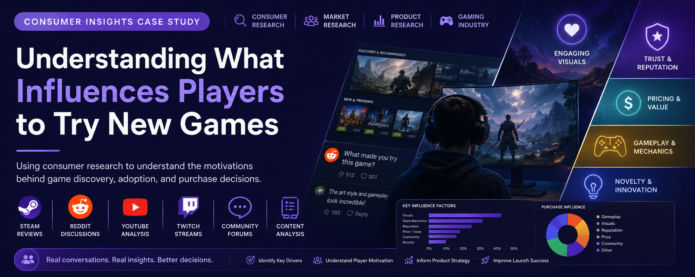

  

<h1 align="center">Understanding What Influences Players to Try New Games</h1>

<b>Consumer Insights</b> • <b>Market Research</b> • <b>Product Research</b> • <b>Behavioral Analysis</b>

> **Using consumer research to understand the motivations behind game discovery, adoption, and purchase decisions.**

---

# Project Overview

| Category | Details |
|----------|---------|
| **Role** | Consumer Insights Researcher |
| **Project Type** | Consumer Research |
| **Research Focus** | Consumer Behavior, Market Research, Product Adoption |
| **Duration** | Graduate Research Project |
| **Research Methods** | Literature Review, Content Analysis, Consumer Research, Thematic Analysis |
| **Data Sources** | Steam Reviews, Reddit, YouTube, Twitch, Gaming Communities |

---

# Executive Summary

Launching a successful game requires more than creating compelling gameplay. Product teams must understand what motivates players to notice, trust, and ultimately purchase a new title before they ever begin playing.

This research explored the factors that influence player adoption by synthesizing discussions across gaming communities, online reviews, livestreams, and existing literature.

The findings identified recurring themes that shape purchase decisions and demonstrated how consumer research can support product strategy, marketing, and positioning before launch.

---

# Product Challenge

Modern games compete for attention in an increasingly crowded marketplace.

Players are exposed to trailers, gameplay videos, online communities, reviews, influencer opinions, pricing strategies, and franchise reputation before deciding whether a game is worth their time and money.

Understanding which of these factors influence adoption helps product teams communicate value more effectively and prioritize features that resonate with their target audience.

This research explored the consumer behaviors and motivations that influence game discovery and purchase decisions.

---

# Why This Matters

Consumer adoption influences the success of every product launch.

Understanding why consumers decide to try a product helps teams improve:

- Product positioning
- Marketing strategy
- Store page optimization
- Pricing decisions
- Community engagement
- Product messaging

Consumer research allows organizations to replace assumptions with evidence when making strategic product decisions.

---

# Objectives

This research focused on five primary objectives.

- Identify the factors that influence players to try a new game.
- Understand how consumer discussions shape purchase decisions.
- Explore the relationship between marketing, reputation, and player expectations.
- Identify recurring themes across gaming communities.
- Translate consumer insights into actionable product recommendations.

---

# My Contribution

As a researcher, I contributed throughout the research process from literature review to synthesis of findings.

My responsibilities included:

- Conducting literature reviews on consumer behavior and game adoption.
- Collecting data from gaming communities and public platforms.
- Analyzing discussions across Steam, Reddit, YouTube, and Twitch.
- Identifying recurring behavioral themes.
- Synthesizing qualitative findings into consumer insights.
- Presenting research findings and product recommendations.

---

# Research Approach

To better understand consumer motivations, this research combined multiple qualitative research methods.

Our approach included:

- Literature review
- Steam review analysis
- Reddit discussion analysis
- YouTube content analysis
- Twitch community observation
- Qualitative coding
- Theme identification
- Research synthesis

Rather than relying on a single source, the study combined multiple consumer perspectives to better understand why players become interested in new games before purchase.

---

# Key Findings

## Visual presentation strongly influences first impressions

Trailers, screenshots, and visual quality consistently shaped player interest during the discovery phase.

## Brand reputation builds consumer confidence

Previous experience with a developer or franchise increased player trust and willingness to purchase.

## Pricing influences perceived value

Players evaluated cost alongside expected gameplay quality when deciding whether to purchase.

## Gameplay remains the strongest purchase driver

Players consistently prioritized enjoyable gameplay mechanics over individual technical features.

## Novelty attracts attention but does not guarantee adoption

Unique ideas generated curiosity, but long-term interest depended on whether players believed the experience offered meaningful value.

---

# Product Recommendations

Based on the research findings, several opportunities consistently emerged.

## Communicate value immediately

Help players understand why the product is different within the first few interactions.

## Build trust before launch

Developer transparency and community engagement strengthen consumer confidence.

## Showcase gameplay early

Players make purchasing decisions based primarily on the expected gameplay experience.

## Support community-driven discovery

Reviews, influencers, and online communities play an important role in product adoption.

## Align pricing with perceived value

Pricing strategies should reinforce the value proposition presented through marketing and gameplay.

---

# Product Applications

Although this research focused on video games, the findings extend to many consumer products and digital experiences.

The behavioral principles explored in this project can inform:

- Video game publishing
- Entertainment platforms
- Digital marketplaces
- Subscription products
- Consumer technology
- Product marketing
- AI product launches

Understanding why consumers adopt products helps teams design stronger value propositions and improve product positioning.

---

# Reflection

## What I Learned

This project strengthened my understanding of consumer research by demonstrating how publicly available discussions reveal meaningful behavioral patterns and market opportunities.

Rather than relying solely on surveys or interviews, I learned how qualitative synthesis across multiple communities can provide valuable insight into trust, adoption, and purchasing behavior.

These lessons continue to influence how I approach consumer insights and product research by emphasizing evidence from real user conversations.

---

# Looking Ahead

With additional time and access to larger datasets, future work would include:

- Social media sentiment analysis
- Machine learning topic modeling
- Large-scale review analysis
- Purchase behavior analytics
- Cross-platform consumer comparisons
- Validation through user interviews

These additional research activities would provide deeper insight into the factors that influence consumer adoption across digital products.
